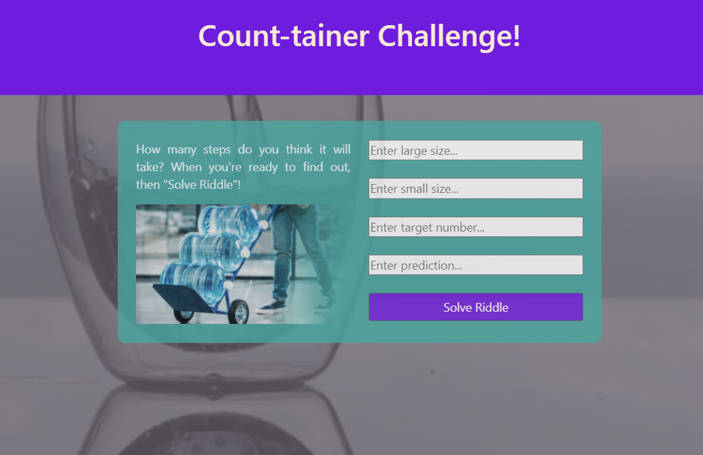

# Count-tainer Challenge!
Unsolvable Riddle? Challenge Accepted!

## The Challenge
Everyone has come across the riddle of the 3 jugs, in one form another.  How can you fill one jug exactly given the limitations?  Your water/liquid source is unlimited, but you've only got 2 other jugs in order to help you get to your target volume.  This simple app helps you find that solution faster.

### CHALLENGE ACCEPTED!
https://count-tainer-challenge.herokuapp.com/

### Technology & Tools

    

### Future Plans

- create a catch/error for inifinite loops
- create 2 path checker for shortest path finder
- add the process and illustrate the steps with words and images